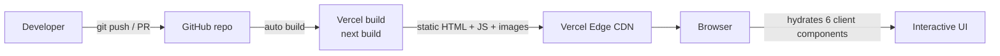
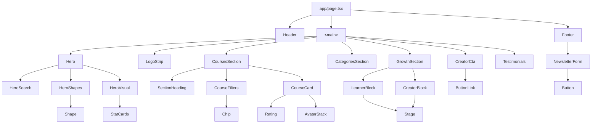
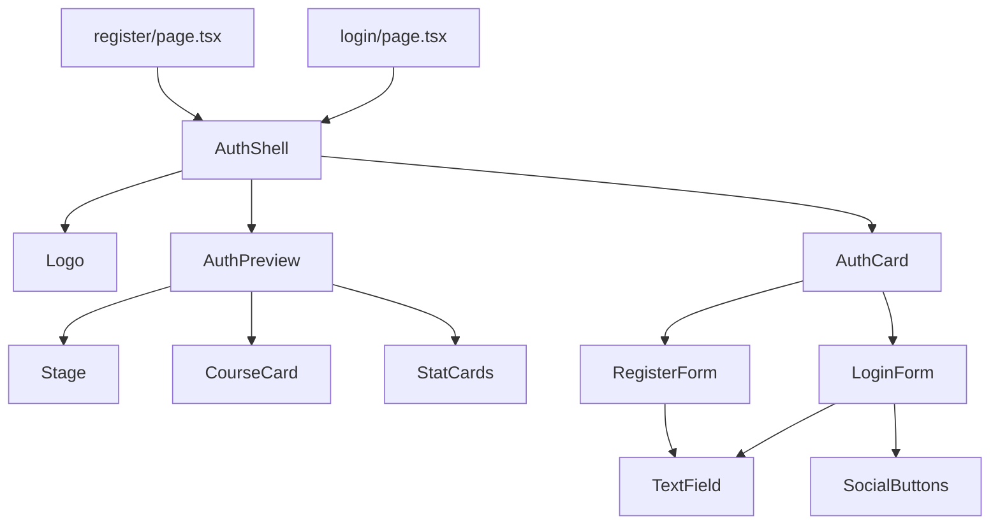
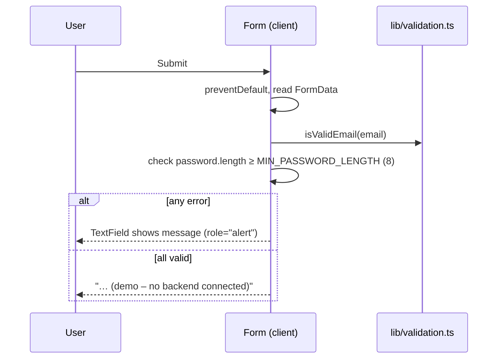
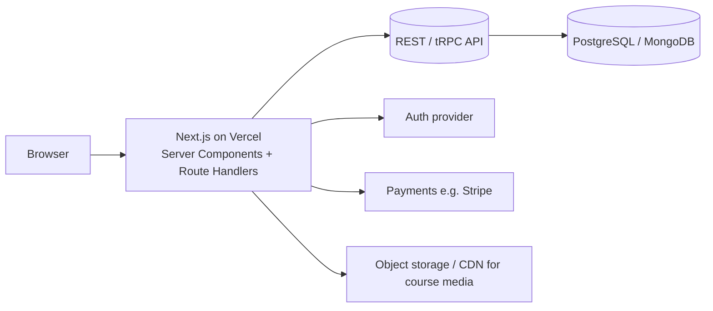
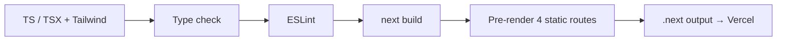

# ByteSpace — System Architecture

> Version 1.0 · Applies to `bytespace-new` v0.1.0
> Companion document: [`requirements.md`](./requirements.md)

---

## 1. Architecture at a Glance

ByteSpace is a **statically rendered, front-end-only** Next.js application. There is no database, no API layer and no server-side state. All content comes from typed TypeScript modules, all pages are pre-rendered at build time, and the only runtime logic is a handful of small interactive Client Components.

| Layer     | Choice                                                             |
| --------- | ------------------------------------------------------------------ |
| Framework | Next.js 14.2 (App Router), React 18.3                              |
| Language  | TypeScript 5 (`strict: true`)                                      |
| Styling   | Tailwind CSS 3.4 + PostCSS / Autoprefixer, a few custom CSS layers |
| Icons     | `lucide-react` 0.468 + inline SVG + PNG icons                      |
| Fonts     | Poppins (`next/font/google`), Satoshi (`next/font/local`, woff2)   |
| Linting   | ESLint 8 with `next/core-web-vitals`                               |
| Hosting   | Vercel (Next.js preset, no environment variables)                  |
| Size      | ~2,200 lines of TS/TSX in `src/`, ~2.6 MB total with assets        |



---

## 2. Project Structure

```
bytespace-main/
├─ public/
│  ├─ images/            avatars, courses, icons, learning-paths, shapes (webp), hero/creator photos
│  └─ logos/             ByteSpace logos (light/dark/mark) + 5 partner logos (SVG)
├─ src/
│  ├─ app/               routes, root layout, global CSS, fonts
│  │  ├─ layout.tsx      fonts, metadata, viewport
│  │  ├─ page.tsx        "/"          landing page
│  │  ├─ login/page.tsx  "/login"
│  │  ├─ register/page.tsx "/register"
│  │  ├─ not-found.tsx   404
│  │  ├─ globals.css     Tailwind layers, bg-grid, glow backgrounds, .stage
│  │  └─ fonts/          Satoshi-Regular / Medium / Bold .woff2
│  ├─ components/
│  │  ├─ ui/             primitives: Button, Chip, Logo, Rating, TextField, AvatarStack,
│  │  │                  Shape, Stage, SectionHeading, Icons
│  │  ├─ cards/          CourseCard, StatCards (Topic, Progress, HappyStudents, Revenue, YearToDate)
│  │  ├─ layout/         Header, Footer, NewsletterForm
│  │  ├─ sections/       Hero, HeroSearch, HeroVisual, LogoStrip, CoursesSection, CourseFilters,
│  │  │                  CategoriesSection, GrowthSection, CreatorCta, Testimonials
│  │  └─ auth/           AuthShell, AuthCard, AuthPreview, LoginForm, RegisterForm, SocialButtons
│  ├─ data/              courses.ts, categories.ts, testimonials.ts, navigation.ts
│  └─ lib/               cn.ts (class joiner), validation.ts (email + password rules)
├─ tailwind.config.ts    design tokens
├─ next.config.mjs       reactStrictMode only
├─ tsconfig.json         strict, alias "@/*" → "src/*"
└─ package.json
```

**Dependency direction** (imports only flow downward — no cycles):

```
app (pages)  →  sections / auth / layout  →  cards  →  ui  →  lib
                         ↘                    ↘
                          data (types + static content)
```

---

## 3. Routing & Rendering

| Route       | File                    | Rendering    | Notes                                   |
| ----------- | ----------------------- | ------------ | --------------------------------------- |
| `/`         | `app/page.tsx`          | Static (SSG) | Composes `Header`, 7 sections, `Footer` |
| `/login`    | `app/login/page.tsx`    | Static       | Own `metadata` title                    |
| `/register` | `app/register/page.tsx` | Static       | Own `metadata` title                    |
| any other   | `app/not-found.tsx`     | Static       | Reuses `Header` + `Footer`              |

- Navigation is in-page anchors (`/#courses`, `/#categories`, `/#creators`) plus links to `/login` and `/register`. Sections use `scroll-mt-4`; `html` has `scroll-behavior: smooth` (disabled under `prefers-reduced-motion`).
- Auth pages deliberately use a different shell (`AuthShell`, small logo mark, no header/footer).

### 3.1 Server vs. Client Components

Everything is a **Server Component by default**. Only six files opt in to the client with `"use client"`, each because it needs state or browser events:

| Client Component             | Why it is client-side                                |
| ---------------------------- | ---------------------------------------------------- |
| `layout/Header.tsx`          | mobile menu open/close state, outside-click listener |
| `layout/NewsletterForm.tsx`  | controlled input, validation status                  |
| `sections/HeroSearch.tsx`    | controlled input, `useRouter().push` on submit       |
| `sections/CourseFilters.tsx` | active chip state                                    |
| `auth/LoginForm.tsx`         | submit handler, error state                          |
| `auth/RegisterForm.tsx`      | submit handler, error state                          |

This keeps the hydrated JavaScript minimal; the large visual sections (hero visual, growth, testimonials, cards) ship as pure HTML.

---

## 4. Component Architecture

### 4.1 Layers

| Layer         | Responsibility                                                                   | Examples                                                                                                                                                 |
| ------------- | -------------------------------------------------------------------------------- | -------------------------------------------------------------------------------------------------------------------------------------------------------- | ------------------- |
| **ui/**       | Stateless, styling-only primitives with a small prop API. No business knowledge. | `Button` / `ButtonLink` (variants `lime` / `blue` / `outline`), `Chip`, `TextField`, `Rating`, `AvatarStack`, `Shape`, `Stage`, `SectionHeading`, `Logo` |
| **cards/**    | Presentational units that combine primitives and take data via props.            | `CourseCard` (`tone: home                                                                                                                                | auth`), `StatCards` |
| **layout/**   | Page chrome shared by several routes.                                            | `Header`, `Footer`, `NewsletterForm`                                                                                                                     |
| **sections/** | Full-width landing-page blocks. Each owns its spacing and background.            | `Hero`, `CoursesSection`, `GrowthSection`, …                                                                                                             |
| **auth/**     | Everything specific to Login / Sign Up.                                          | `AuthShell`, `AuthCard`, forms                                                                                                                           |

### 4.2 Landing-page composition



### 4.3 Auth composition



### 4.4 Reuse in practice

- `CourseCard` is used in the Courses grid, the Growth section and the Auth preview (via the `tone` prop for star / badge colors).
- `HappyStudentsCard` / `ProgressCard` appear in Hero, Growth and Auth previews.
- `Header` / `Footer` are shared by Landing and 404.
- `Button` / `ButtonLink` share one `BASE` class string and a `VARIANTS` map.
- `TextField` is shared by both auth forms and wires `label`, `aria-invalid` and `aria-describedby` automatically.

---

## 5. Data Layer

All content is in `src/data/` as typed constants — a deliberate seam for a future API.

| File              | Exports                                                                                    | Used by                                                                     |
| ----------------- | ------------------------------------------------------------------------------------------ | --------------------------------------------------------------------------- |
| `courses.ts`      | `Course` interface, `COURSES` (6 items), `COURSE_STUDENT_AVATARS`, `HAPPY_STUDENT_AVATARS` | `CoursesSection`, `GrowthSection`, `AuthPreview`, `CourseCard`, `StatCards` |
| `categories.ts`   | `COURSE_FILTER_ROWS` (3 rows of chips), `LEARNING_PATHS` (6 tiles with icon size)          | `CourseFilters`, `CategoriesSection`                                        |
| `testimonials.ts` | `Testimonial`, `TESTIMONIALS` (3)                                                          | `Testimonials`                                                              |
| `navigation.ts`   | `NavLink`, `MAIN_NAV`, `FOOTER_LINK_COLUMNS`, `LEGAL_LINKS`                                | `Header`, `Footer`                                                          |

```ts
interface Course {
  id: string; // URL-safe slug, e.g. "learn-figma-from-basic"
  title: string;
  author: string;
  rating: number;
  lessons: number;
  duration: string;
  comments: number;
  level: "Beginner" | "Intermediate" | "Advanced";
  price: number; // USD, shown as "$25 /lifetime"
  image: string; // path under /public
}
```

**Migration path:** replace `COURSES` with `await fetch(...)` / a DB query inside `CoursesSection` (it is already a Server Component), keep the `Course` type as the contract.

---

## 6. Styling System

### 6.1 Design tokens (`tailwind.config.ts`)

- **Colors:** `neutral` (50–950), `primary` (blue, 500–900 used most; main brand is `primary-800` #003be2), `secondary` (lime, `secondary-400` #d4fb20 is the accent), `ink` #040819.
- **Typography:** custom `fontSize` entries bundle size + line-height + weight — `text-heading-l/m/s/xs`, `text-body-l/m/s/xs`, `text-label-l/m/s/xs`.
- **Layout:** `max-w-page` = 1200px; `.container-x` adds responsive padding (`px-5 md:px-8 xl:px-0`).
- **Font families:** `font-heading` → Poppins, `font-body` → Satoshi (see §9, issue 1).

### 6.2 Custom CSS (`globals.css`)

| Class                                      | Purpose                                                          |
| ------------------------------------------ | ---------------------------------------------------------------- |
| `.container-x`                             | centred 1200px content column                                    |
| `.bg-grid`                                 | 120px white grid lines over the blue hero / CTA / 404 background |
| `.bg-glow-growth`, `.bg-glow-testimonials` | multi-layer radial-gradient backgrounds for those sections       |
| `.stage`, `.stage-inner`                   | proportional-scaling container (see 6.3)                         |

### 6.3 The `Stage` pattern

Figma compositions (cards floating over a photo with shapes) are built with absolute positions at their **design size** (e.g. 640×552). `Stage` wraps them:

1. Outer `.stage` has `width = stageWidth × --stage-scale`, `height = stageHeight × --stage-scale`.
2. Inner `.stage-inner` keeps the full design size and is `transform: scale(var(--stage-scale))` from the top-left.
3. `--stage-scale` changes by breakpoint: **0.55** (base) → **0.75** (≥480) → **0.95** (≥640) → **0.78** (≥1024, because the layout becomes two-column) → **1** (≥1280).

Trade-off: pixel-perfect visuals with very little CSS, at the cost of text getting smaller on phones rather than reflowing. `HeroVisual` applies the same idea with Tailwind scale utilities.

### 6.4 Utility conventions

- `cn(...)` (`lib/cn.ts`) joins class strings and drops falsy values. It does **not** resolve Tailwind conflicts (no `tailwind-merge`), so overrides rely on source order or `!important` (`!h-[119px]` is used in a few places).
- Components expose `className` so parents can position them (`absolute left-[…] top-[…]`).

---

## 7. State, Forms & Interaction

There is **no global state**. All state is local to six components.

| Feature            | Mechanism                                                                          |
| ------------------ | ---------------------------------------------------------------------------------- |
| Mobile menu        | `useState(open)`; `mousedown` listener added only while open; closes on link click |
| Course chip filter | `useState(active)`; `aria-pressed` on chips                                        |
| Hero search        | controlled input; submit → `router.push("/#courses")`                              |
| Newsletter         | `status: idle \| error \| success`; clears input on success                        |
| Login / Sign Up    | **uncontrolled** inputs; `FormData` read on submit; `errors` + `submitted` state   |

### 7.1 Validation flow (login / sign up)



Rules: email `^[^\s@]+@[^\s@]+\.[^\s@]+$`; password ≥ 8; name ≥ 2 (sign up only). Nothing leaves the browser.

---

## 8. Assets, Fonts & Performance

- **Images** — rendered with `next/image` (automatic resizing, lazy-loading, `sizes` hints on `CourseCard` and `Shape`). Logos use `unoptimized` because they are SVGs. Decorative shapes are `.webp`; photos, avatars and course thumbnails are `.png`.
- **Fonts** — Poppins weights 500/600 via `next/font/google` (downloaded at build, self-served); Satoshi 400/500/700 via `next/font/local`. Both use `display: "swap"` and expose CSS variables on `<html>`.
- **Above the fold** — hero student image and header logo use `priority`.
- **Weight** — avatars (~924 KB) and course images (~400 KB) are the heaviest assets in `public/`; `next/image` serves resized variants, but source files could still be converted to WebP/AVIF.
- **JavaScript** — only the six client components plus React/Next runtime are hydrated.

---

## 9. Known Issues & Recommendations

Ordered by impact. Items 1–3 are worth fixing before any further feature work.

| #   | Area                  | Finding                                                                                                                                                                                                                                                                                             | Recommendation                                                                                                                                  |
| --- | --------------------- | --------------------------------------------------------------------------------------------------------------------------------------------------------------------------------------------------------------------------------------------------------------------------------------------------- | ----------------------------------------------------------------------------------------------------------------------------------------------- |
| 1   | **Fonts**             | `tailwind.config.ts` sets `font-body` to the literal name `"Satoshi"`, while `next/font/local` registers the face under a generated family name and exposes it via `--font-satoshi`, which nothing references. Satoshi is therefore likely **not applied** and body text falls back to `system-ui`. | Use `body: ["var(--font-satoshi)", "ui-sans-serif", "system-ui", …]` and verify in DevTools → Computed → Rendered Fonts.                        |
| 2   | **Dead interactions** | Course chips only change highlight; "+ More", the cart button and Facebook/Google buttons do nothing; hero search ignores the typed query.                                                                                                                                                          | Add a `category` to `Course`, filter in a small client wrapper, wire the search query (`?q=`), and mark placeholders `disabled` or remove them. |
| 3   | **Metadata**          | No favicon / `icon.png`, no Open Graph or Twitter tags.                                                                                                                                                                                                                                             | Add `src/app/icon.png`, `opengraph-image.png` and fuller `metadata`.                                                                            |
| 4   | **Copy**              | Newsletter submit button says "Search"; footer reads "@ 2023"; several footer/legal links are `#`.                                                                                                                                                                                                  | "Subscribe", dynamic year, real routes or remove.                                                                                               |
| 5   | **Header**            | `aria-current="page"` and bold style are hard-coded to the first item, so Home looks active on every route. The cart icon exists only on desktop. Mobile menu has no Escape-to-close or focus trap.                                                                                                 | Use `usePathname()` for the active link; add the cart to the mobile bar; handle `keydown` Escape.                                               |
| 6   | **Duplication**       | `NewsletterForm` re-implements the email regex that already exists as `isValidEmail`.                                                                                                                                                                                                               | Import from `lib/validation`.                                                                                                                   |
| 7   | **Dead code**         | `FacebookIcon`, `GoogleIcon` are imported (unused) in `SocialButtons`; `LevelIcon` is never used; commented-out `console.log` lines remain in `RegisterForm`.                                                                                                                                       | Remove to keep lint output clean.                                                                                                               |
| 8   | **Class merging**     | `cn()` does not resolve Tailwind conflicts; `!important` overrides are used in `GrowthSection`.                                                                                                                                                                                                     | Adopt `clsx` + `tailwind-merge`.                                                                                                                |
| 9   | **Accessibility**     | Several decorative-ish images have noisy alts ("Cart Image", "Label icon", "Logoipsum", "Testimonials avatar"); no skip-to-content link.                                                                                                                                                            | Use `alt=""` for decorative images, descriptive alt where meaningful, add a skip link.                                                          |
| 10  | **Layout robustness** | Hero uses a fixed `lg:h-[1024px]` with an absolutely positioned visual; `.stage` text shrinks on phones.                                                                                                                                                                                            | Acceptable for the brief; consider fluid heights if content grows.                                                                              |
| 11  | **Quality gates**     | No tests, no CI, no Prettier config.                                                                                                                                                                                                                                                                | Add Vitest + Testing Library for forms, Playwright smoke tests, and a GitHub Action running `lint` + `build`.                                   |
| 12  | **Naming**            | Token names `primary` / `secondary` hide the Figma names (Electric Violet / Crimson), which is intentional but easy to confuse.                                                                                                                                                                     | Keep the existing comment in the config, or alias both names.                                                                                   |

---

## 10. Extension Roadmap

```mermaid
flowchart LR
    A[Current: static UI] --> B[Dynamic data<br/>API / CMS for courses]
    B --> C[Course detail pages<br/>/courses/&#91;id&#93;]
    B --> D[Search & filtering<br/>?q= &amp; ?category=]
    A --> E[Real auth<br/>Auth.js or backend JWT]
    E --> F[User dashboard<br/>cart, purchases]
    E --> G[Creator dashboard<br/>Course Editor]
    A --> H[Quality<br/>tests, CI, analytics]
```



Suggested target architecture when a backend is added:



Because content is already isolated in `src/data` and UI is separated by layer, each step above can be added without restructuring the existing components.

---

## 11. Build, Deployment & Workflow

| Topic       | Details                                                                                                               |
| ----------- | --------------------------------------------------------------------------------------------------------------------- |
| Scripts     | `npm run dev`, `build`, `start`, `lint`                                                                               |
| Environment | none required; no `.env` files                                                                                        |
| Hosting     | Vercel, framework preset _Next.js_; every push to a PR branch gets a preview deployment, `main` deploys to production |
| Git flow    | `feat/auth` → (PR) → `feat/landing-page` → (PR) → `main`; no direct commits to `main`                                 |
| Ignored     | `node_modules`, `.next`, `out`, `build`, `coverage`, `.env*.local`, `.vercel`, `*.tsbuildinfo`, `.DS_Store`           |

### 11.1 Build pipeline



---

## 12. Glossary

| Term                 | Meaning                                                                         |
| -------------------- | ------------------------------------------------------------------------------- |
| **App Router**       | Next.js routing based on the `app/` directory and Server Components.            |
| **Server Component** | Component rendered on the server/build; sends no JS for itself.                 |
| **Client Component** | Component marked `"use client"`; hydrated in the browser.                       |
| **Stage**            | Local helper that scales a fixed-size design composition to fit the viewport.   |
| **Learning path**    | A top-level course category tile in `CategoriesSection`.                        |
| **Token**            | A named design value (color, size, width) defined once in `tailwind.config.ts`. |
